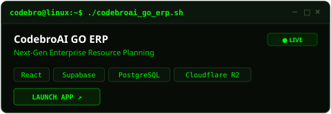
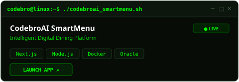
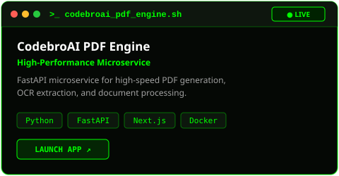
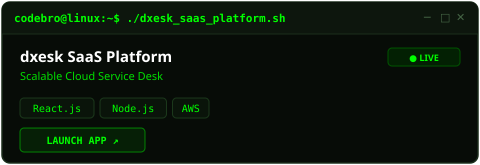
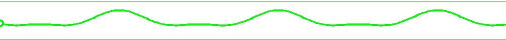

<!-- HEADER SECTION -->

  

  
  
  
  
  

  

  

<!-- ABOUT ME & ILLUSTRATION SECTION -->

  <h2><samp>➜ ~ /whoami</samp></h2>
  <samp>
    <b>[+] Status:</b> Founder & Systems Architect @ <i>CodebroAI</i>  
    <b>[+] Role:</b> Full-Stack Engineer & DevSecOps Advocate  
    <b>[+] Education:</b> BSc (Hons) Computing @ <i>Coventry University</i>  
    <b>[+] Focus:</b> Cloud Infra, Backend Arch, AI Automation, Enterprise Security  
    <b>[+] Stack:</b> Linux, Java (Spring), Python (FastAPI), React/Next.js, Docker, AWS 
  </samp>

  

<!-- GITHUB CONTRIBUTION SNAKE ANIMATION -->

  <picture>
    <source media="(prefers-color-scheme: dark)" srcset="https://raw.githubusercontent.com/Bhanu2ko3/Bhanu2ko3/output/github-contribution-grid-snake-dark.svg">
    <source media="(prefers-color-scheme: light)" srcset="https://raw.githubusercontent.com/Bhanu2ko3/Bhanu2ko3/output/github-contribution-grid-snake.svg">
    
  </picture>

  

<!-- TECH STACK -->
<h2 align="center"><samp>&gt;_ ls /tech_stack/</samp></h2>

<table align="center" border="0" width="100%">
  <tr>
    <td align="center" width="100%">
       
      <samp><b>[ FRONTEND & UI ]</b></samp>
        
      
      
      
      
      
      
      
      
      
        
    </td>
  </tr>
  <tr>
    <td align="center" width="100%">
       
      <samp><b>[ BACKEND & AUTH ]</b></samp>
        
      
      
      
      
      
      
      
        
    </td>
  </tr>
  <tr>
    <td align="center" width="100%">
       
      <samp><b>[ DATABASE ]</b></samp>
        
      
      
      
      
        
    </td>
  </tr>
  <tr>
    <td align="center" width="100%">
       
      <samp><b>[ DEVOPS & CLOUD ]</b></samp>
        
      
      
      
      
      
      
      
        
    </td>
  </tr>
  <tr>
    <td align="center" width="100%">
       
      <samp><b>[ MOBILE DEVELOPMENT ]</b></samp>
        
      
      
      
      
        
    </td>
  </tr>
</table>

  

<!-- PROJECTS SECTION -->
<h2 align="center"><samp>&gt;_ execute ./recent_deployments.sh</samp></h2>

<table align="center" width="100%">
  <tr>
    <td width="50%" align="center" valign="top">
      
    </td>
    <td width="50%" align="center" valign="top">
      
    </td>
  </tr>
  <tr>
    <td width="50%" align="center" valign="top">
      
    </td>
    <td width="50%" align="center" valign="top">
      
    </td>
  </tr>
  <tr>
    <td width="50%" align="center" valign="top">
      
    </td>
    <td width="50%" align="center" valign="top">
      
    </td>
  </tr>
</table>

  

<!-- SERVICES SECTION -->
<h2 align="center"><samp>&gt;_ cat /etc/services.conf</samp></h2>

<table align="center" width="100%">
  <tr>
    <td width="50%" valign="top">
      <samp>
        <b>[01] AI & Automation Solutions</b> 
        <small>AI Assistants, Smart Workflows, AR Menus & Automated Agents.</small>
      </samp>
    </td>
    <td width="50%" valign="top">
      <samp>
        <b>[02] Custom Enterprise ERP Systems</b> 
        <small>Offline-First ERPs, Inventory Sync, Payroll & Business Analytics.</small>
      </samp>
    </td>
  </tr>
  <tr>
    <td width="50%" valign="top">
       
      <samp>
        <b>[03] High-Performance Web Engineering</b> 
        <small>Scalable, SEO-Optimized Web Platforms & Cloud Ecosystems.</small>
      </samp>
    </td>
    <td width="50%" valign="top">
       
      <samp>
        <b>[04] Mobile App Development</b> 
        <small>Cross-Platform iOS & Android Apps with Native Performance.</small>
      </samp>
    </td>
  </tr>
  <tr>
    <td width="50%" valign="top">
       
      <samp>
        <b>[05] Biometrics & Security Systems</b> 
        <small>Facial Recognition Attendance, CBIS Threat Intelligence & Security.</small>
      </samp>
    </td>
    <td width="50%" valign="top">
       
      <samp>
        <b>[06] UI/UX Design & Prototyping</b> 
        <small>Interactive Prototypes, Wireframing & High-End Product Experience.</small>
      </samp>
    </td>
  </tr>
</table>

  

<!-- GITHUB STATS SECTION -->
<h2 align="center"><samp>&gt;_ cat /var/log/github_metrics.log</samp></h2>

  
  

  

  

